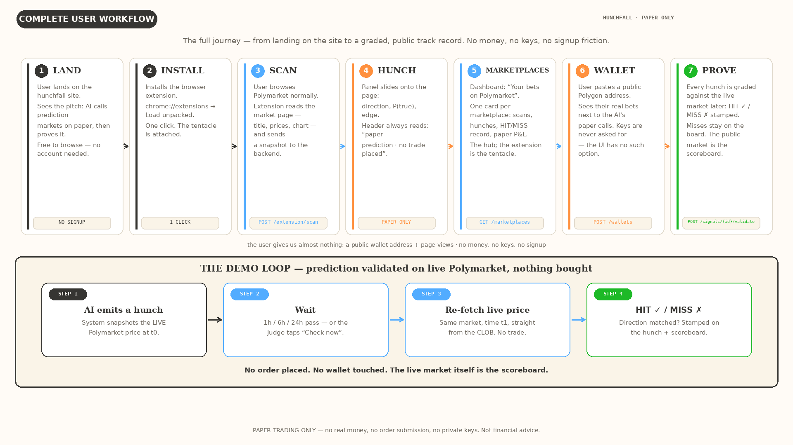

# User workflow

How a user moves through the hunchfall dashboard, and how the AI proves its
predictions against live Polymarket prices without ever placing a trade.

## The six screens

| # | Screen | What the user sees | API |
|---|--------|-------------------|-----|
| 1 | Overview | Paper bankroll equity curve, open paper positions, today's hunches, kill-switch state | `GET /status` |
| 2 | Hunches | Prediction feed — market, P(true), live price, edge %, YES/NO side, timestamp; tap for full reasoning | `GET /signals` |
| 3 | Validation ⭐ | Did the AI get it right? Predicted direction vs live price now, HIT ✓ / MISS ✗ stamped per hunch | `POST /signals/{id}/validate` (built — RFC-001) |
| 4 | Positions | Paper book — simulated fills at live CLOB prices, fees applied, P&L, MOCK labels | `GET /positions` |
| 5 | Vetoes | Every abstention with its reason (spread too wide, UMA risk, low confidence…) | `GET /vetoes` |
| 6 | Kill switch | Big red button — halts the loop, flattens the paper book; resume is human-only | `POST /kill` |

User path: **1 → 2 → 3** is the demo; **4–5** are the books; **6** is the
ever-present escape hatch.

## The demo loop (screen 3)

1. AI emits a hunch → backend snapshots the **live** Polymarket price (t0).
2. Wait 1h / 6h / 24h — or the judge taps "Check now".
3. Re-fetch the live price for the same market (t1) from the CLOB. No trade.
4. Direction matched? Stamp **HIT ✓ / MISS ✗** on the hunch and update the
   scoreboard + calibration page.

No order placed. No wallet touched. The live market itself is the scoreboard.

## Implemented in RFC-001

- `POST /signals/{id}/validate` — records the HIT/MISS verdict (append-only),
  re-checks the live CLOB price as evidence, and updates calibration on read.
- `POST /extension/scan` — re-validates a market-page hint through Gamma,
  CLOB, and Data API v2 before recording a paper prediction
  (“paper prediction · no trade placed” — no fill is ever placed).
- `POST /wallets` + `GET /wallets/{address}/activity` — watch-only registry
  (secrets rejected with 400) and read-only activity with graceful degradation.
- `GET /marketplaces` — per-marketplace scans/hunches/validations.

## Implemented in RFC-003 (market guesser — prediction only)

- `POST /predict` — given `{market_slug | condition_id}`, builds a snapshot
  from official APIs (Gamma + CLOB, plus a `/v2/trades` tape) and a keyless
  social pulse, asks the model N times for **P(YES)**, and returns a typed
  prediction — or an honest **abstention** when `|edge| < PREDICT_ABSTAIN_EDGE`.
  No gate, no sizing, no fills.
- `GET /predict/demo` — runs the pinned demo market; falls back to a committed
  canned snapshot, so the dashboard shows a real result card with zero setup.
  **Always 200, never persists.**
- `GET /predict/accuracy` — derived-on-read ledger: Brier vs market vs
  always-0.5, Brier skill, direction accuracy, abstention rate, and a
  mock/live split (mock excluded from the headline by default).
- `POST /predict/{prediction_id}/resolve` — records the realised YES/NO
  outcome (append-only; manual settlement for the MVP).

The social-media analyzer (Bluesky Jetstream + Reddit + RSS, all keyless) is
**the data source for social-outcome markets** — post counts and engagement in
a bounded window, not generic sentiment. X is excluded; X-centric markets are
labelled a **proxy**. Its numbers are a feature in the snapshot and the UI —
they can never set the direction or the abstention.
